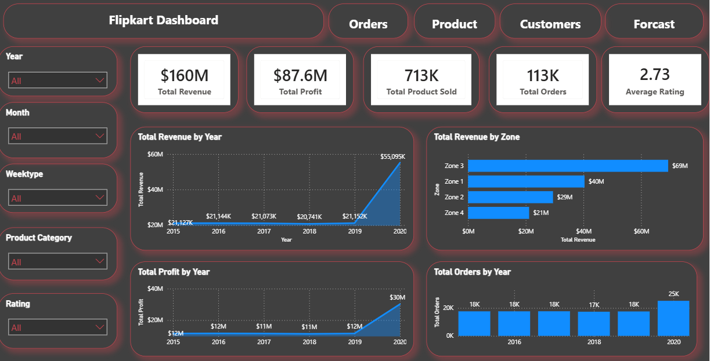
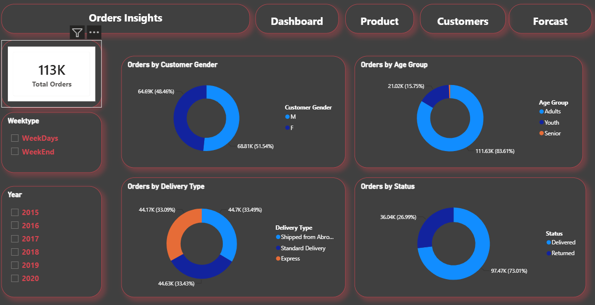
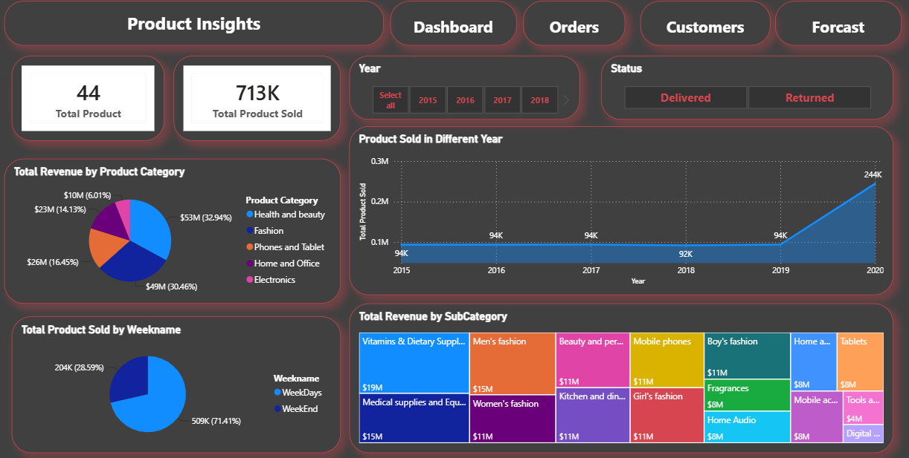
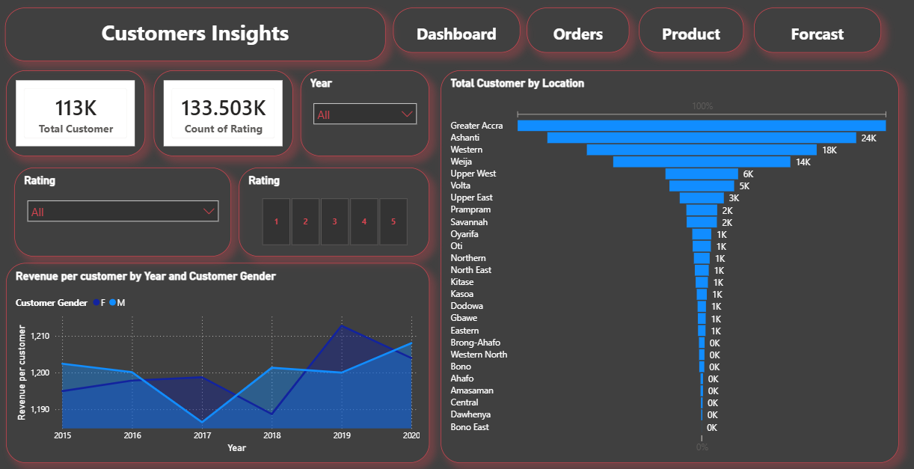
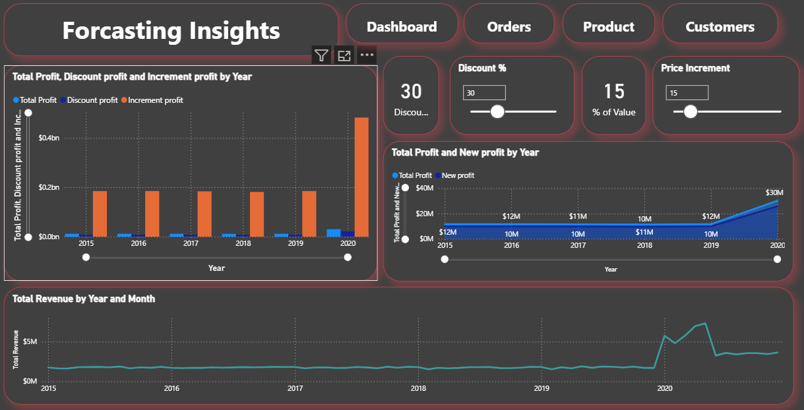
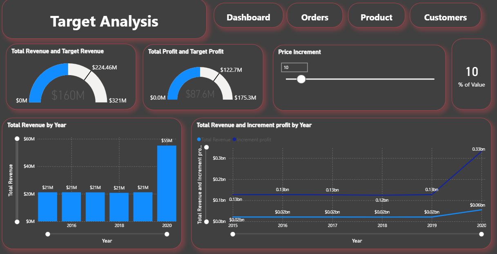

# 📊 Power BI Sales & Customer Analytics Dashboard

An interactive **Power BI Sales & Customer Analytics Dashboard** developed to analyze sales, orders, customers, products, profitability, targets, and forecasting scenarios.

The project combines **Power BI, DAX, Power Query, and data modeling** to transform raw business data into meaningful KPIs and interactive visualizations.

---

## 🎯 Project Objectives

The main objectives of this project are:

- Analyze overall sales and revenue performance.
- Monitor total profit and profitability.
- Analyze order volume and order status.
- Understand customer demographics.
- Analyze customer age groups and gender.
- Identify high-performing products and categories.
- Compare actual performance against targets.
- Analyze the impact of discounts and price increments.
- Compare weekday and weekend order behavior.
- Provide detailed transactional analysis.
- Build an interactive business intelligence dashboard.

---

## 🛠️ Technologies Used

| Technology | Purpose |
|---|---|
| **Power BI** | Dashboard and data visualization |
| **DAX** | Measures, calculated columns and business calculations |
| **Power Query** | Data cleaning and transformation |
| **Data Modeling** | Relationships and analytical model |
| **Excel / CSV** | Data source where applicable |

---

## 📑 Dashboard Pages

The Power BI report contains the following pages:

### 🏠 1. Front Page
Landing page for the report with navigation to the different analytical sections.


<p align="center">
  
</p>

### 📈 2. Dashboard
Provides an executive-level overview of important KPIs such as:

- Total Revenue
- Total Profit
- Total Orders
- Total Customers
- Total Products
- Average Rating
- Revenue per Customer

<p align="center">
  
</p>

### 📦 3. Order Analysis
Provides detailed order analysis including:

- Total Orders
- Delivered Orders
- Returned Orders
- Order Status
- Delivery Type
- Customer Gender
- Customer Age Group
- Weekday vs Weekend
- Time-based order analysis

<p align="center">
  
</p>

### 🛍️ 4. Product Analysis
Analyzes product performance based on:

- Product Category
- Product Subcategory
- Products Sold
- Product Rating
- Revenue
- Sales performance

<p align="center">
  
</p>

### 👥 5. Customer Analysis
Provides customer-level analysis using:

- Customer Age
- Customer Gender
- Age Group
- Customer Count
- Revenue per Customer
- Customer order behavior

<p align="center">
  
</p>

### 🔮 6. Forecasting
Provides analysis related to:

- Forecasting
- Discount percentage
- Price increment
- Discount profit
- Increment profit

<p align="center">
  
</p>

### 🎯 7. Target Analysis
Compares actual performance against business targets.

Key metrics include:

- Target Revenue
- Actual Revenue
- Target Profit
- Actual Profit

<p align="center">
  
</p>


### 📋 8. Detailed View
Provides detailed data for deeper investigation and drill-down analysis.

---

# 📌 Key KPIs

The dashboard contains several important measures:

- **Total Revenue**
- **Total Profit**
- **Total Orders**
- **Total Customers**
- **Total Products**
- **Total Products Sold**
- **Average Rating**
- **Revenue per Customer**
- **Average Order Value**
- **Target Revenue**
- **Target Profit**
- **Discount Value**
- **Discount Profit**
- **Increment Profit**

---

# 👥 Customer Segmentation

Customers are classified into different age groups.

| Age Range | Age Group |
|-----------|-----------|
| 0–14 | Children |
| 15–24 | Youth |
| 25–64 | Adults |
| 65+ | Senior |

This classification helps identify which customer segments contribute most to the business.

---

# 📅 Time Analysis

The dashboard supports analysis based on:

- Year
- Month
- Week
- Weekday
- Weekend
- Previous Year
- Year-over-Year Growth

### Weekend / Weekday Classification

Saturday and Sunday are classified as **Weekend**, while Monday to Friday are classified as **Weekday**.

Example DAX:

```DAX
Weekend Weekday =
IF(
    WEEKDAY('Calendar'[Date] = "Saturday" || 'Calendar'[Date] = "Sunday",
    "Weekend",
    "Weekday"
)
